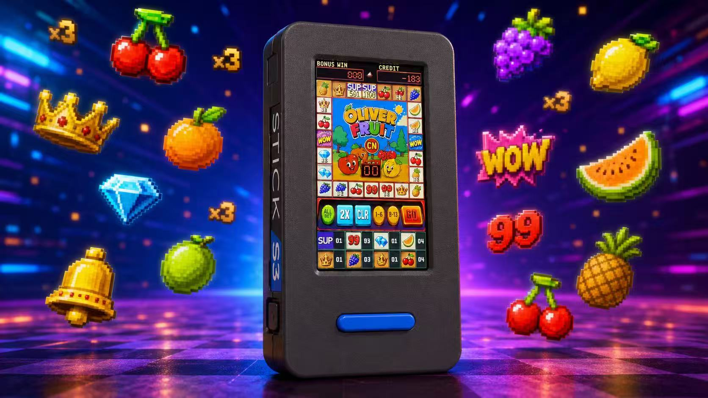
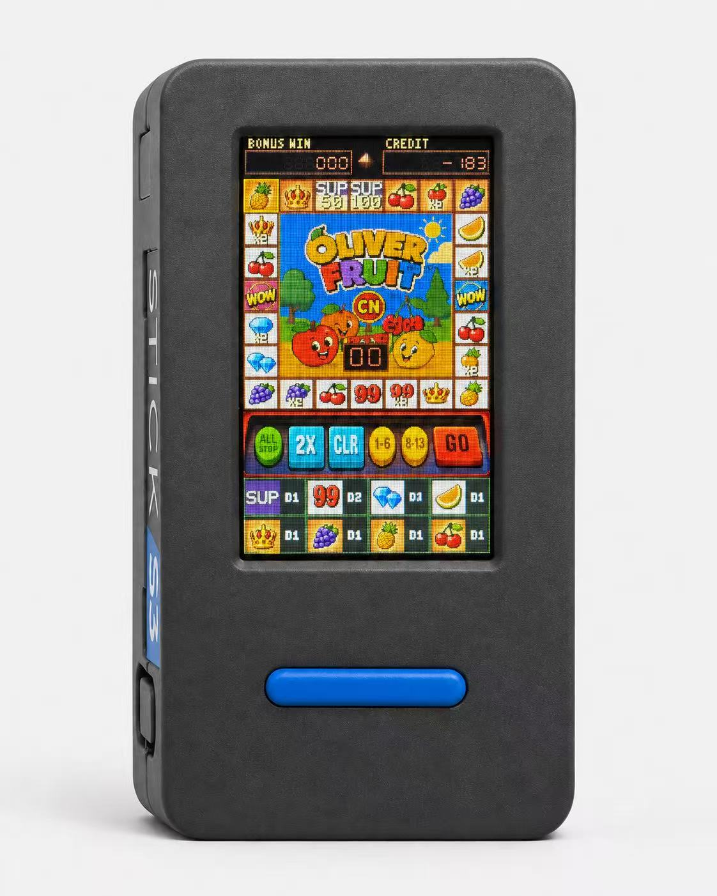
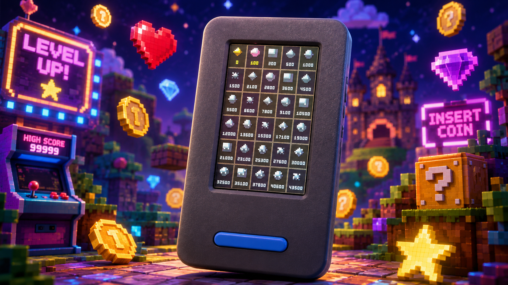

<div align="center">
  <h1>怀旧水果机</h1>
  <p><strong>专为 M5Stack StickS3 打造的掌上怀旧街机</strong></p>
  <p>
    四方向体感选择、24格跑灯、大小竞猜，<br>
    再加一套可以长期收集的30颗宝石系统。
  </p>
  <p>
    <a href="#项目概览">项目概览</a> ·
    <a href="#v070-更新与升级说明">v0.7.0</a> ·
    <a href="#完整操作说明">操作</a> ·
    <a href="#游戏规则">玩法</a> ·
    <a href="#30颗宝石收藏">宝石</a> ·
    <a href="#编译">编译</a> ·
    <a href="README.md">English</a>
  </p>
  <p>
    
    
    
    
    
  </p>
  <br>
  
</div>

## v0.7.0 更新与升级说明

发布于2026年8月1日。固件下载和完整发布说明见
[v0.7.0 Release](https://github.com/oliverxing2025/nostalgic-fruit-machine/releases/tag/v0.7.0)。

- **X3正确结算：**X3现在为图标完整倍率的3倍；皇冠为25/75倍，99为40/120倍。
- **左右WOW重新平衡：**左侧按权重抽取5—60倍总押注；右侧独立开奖5次并逐次显示累计。
- **四灯幸运保护：**连续4次付费开奖未净赢时，下一局保证停在最近盈利格。
- **结算信息更清晰：**开奖后显示 `BET / WIN / NET`；大小竞猜显示
  `WIN / RISK / SAFE`，可直接看到25%、50%、75%或100%风险比例。
- **节奏与回报平衡：**八种各押1注时，含四灯保护的理论返还率约104.47%，
  长期净赢局占比约38.38%。
- **实时电池状态：**顶部现在显示电量和充电状态。

### 升级方式

| 下载文件 | 写入地址 | 适用场景 | 已保存数据 |
| --- | ---: | --- | --- |
| `Nostalgic-Fruit-Machine-v0.7.0-app.bin` | `0x20000` | 已确认设备身份及兼容分区布局的现有设备升级 | 保留 NVS 中的 CREDIT、统计、押注和宝石状态 |
| `Nostalgic-Fruit-Machine-v0.7.0-full.bin` | `0x0` | 全新独立安装，或明确要替换现有固件布局 | 重置 NVS 和全部游戏存档 |

> [!WARNING]
> 写入前必须核对实体设备身份、分区布局、镜像和地址。完整镜像会替换多固件布局
> 并清除水果机存档；仅应用镜像也只能用于已经确认兼容布局的设备。

## 项目概览

怀旧水果机把 StickS3 变成一台可以握在手里的独立迷你街机：135 × 240
竖屏中完整容纳24格转盘、6个功能按钮、8类图标押注、CREDIT 和 BONUS WIN，
以及色彩鲜明的水果主题中间画面；不需要手机、账户或网络。

| | 核心能力 | 带来的体验 |
| --- | --- | --- |
| **01** | 怀旧跑灯转盘 | 加速、匀速跑圈、减速并精确停在预定结果，灯光与声音同步。 |
| **02** | 四方向体感操作 | 前、后、左、右倾斜即可在三排按钮间选择，并带回中锁和拿起恢复。 |
| **03** | 多层奖励玩法 | 8类押注、X3、两种 LUCK、大小竞猜、稀有大奖、Big Bang 和免费转动。 |
| **04** | 长期宝石收藏 | 当前 CREDIT 首次达到各档门槛时，永久点亮30颗不同颜色的宝石。 |

> 本项目仅供娱乐。所有 CREDIT 均为虚拟分数，不包含充值、提现、兑换现金、
> 广告、账户、数据分析或联网赌博功能。

> [!NOTE]
> 宣传图片为产品效果图，个别视觉细节可能与当前实机屏幕和固件版本略有差异。

<div align="center">
  
</div>

## 设备体验

- 24格顺时针跑灯，包含加速、匀速、减速、同步音效和当前图标逆光点亮效果。
- 8类图标分别押注 `00`–`99`，并提供 `ALL+1`、`2X`、`CLR`、大小和
  `GO` 操作。
- `CREDIT` 右侧显示加长的实时电池图标，颜色与 credit 数字一致，充电时显示闪电符号。
- 每次开奖后在中央显示 `BET / WIN / NET`，直接看出本局押注、中奖和净赢亏。
- 中央画面上沿有4颗幸运灯；连续未净赢时逐颗点亮，4颗全亮后下一次付费开奖保证净赢。
- 使用 StickS3 内置 BMI270 加速度计完成前、后、左、右四方向选择。
- 带回中锁：每次倾斜只移动一次，设备回正后才接受下一次方向动作。
- 设备长时间放置后，拿起时自动检测并重新建立自然握持基准。
- 中奖后可选择25%、50%、75%或100%额度参与大小竞猜。
- 包含橙色 LUCK、蓝色 LUCK、稀有大奖、Big Bang 和自动免费转动。
- 30颗宝石收藏，依据当前 CREDIT 首次达到的最高档位逐级永久解锁。
- CREDIT、押注、统计、声音、游戏状态和宝石进度均通过 NVS 持久保存。
- 运行期界面不反复分配对象；每次开机自动执行1000轮逻辑自检。

## 硬件与软件

| 项目 | 要求 |
| --- | --- |
| 设备 | M5Stack StickS3 |
| 屏幕 | 135 × 240 竖屏 |
| 体感 | BMI270 加速度计 |
| 音频 | ES8311 编解码器与机身扬声器 |
| 开发框架 | ESP-IDF 5.5.x |
| 界面 | LVGL |
| 当前固件版本 | 0.7.0 |

方向选择只使用加速度计数据，不使用陀螺仪积分计算角度。

## 快速开始

1. 短按侧键一次，增加5个虚拟 CREDIT。
2. 前后左右倾斜设备，移动黄色选择框。
3. 选择一种水果或图标，短按正面蓝键增加押注。
4. 选择 `GO` 后短按蓝键，或在任意选择位置双击蓝键，开始转动。
5. 中奖后选择参与竞猜的百分比，再选择小、大或直接收取。
6. 长按侧键约1秒，进入30颗宝石收藏界面。

## 完整操作说明

### 前后左右体感操作

以自然姿势竖向握住设备：

| 设备动作 | 普通押注界面 | 中奖待处理界面 |
| --- | --- | --- |
| 向左倾斜 | 在当前一排向左移动选择 | 降低参与比例：100 → 75 → 50 → 25% |
| 向右倾斜 | 在当前一排向右移动选择 | 提高参与比例：25 → 50 → 75 → 100% |
| 向前/向上倾斜 | 移动到上一排横向位置最接近的按钮 | 反向轮换“小、 大、 收取” |
| 向后/向下倾斜 | 移动到下一排横向位置最接近的按钮 | 正向轮换“小、 大、 收取” |
| 回到自然中间姿势 | 解锁下一次方向动作 | 解锁下一次方向动作 |

每次倾斜只触发一次。完成动作后，需要短暂回到自然中间姿势，再进行下一次
倾斜。如果设备放置较久后拿起发现方向暂时无反应，请先以自然姿势稳定握持
片刻，再倾斜并回正；固件会自动识别“拿起”动作并重新校准基准。

跑灯、连续奖励、Big Bang 或宝石图鉴运行时，方向选择会暂时停用，避免误触。

### 正面蓝键

| 操作 | 功能 |
| --- | --- |
| 单击 | 执行当前选中的按钮 |
| 双击 | 直接启动 `GO`；中奖待处理时直接收取 |
| 长按约0.9秒 | 当前图标押注减1；在 `ALL+1` 上长按则清空全部押注 |

### 侧键

| 操作 | 功能 |
| --- | --- |
| 单击 | 增加5个虚拟 CREDIT |
| 连按4次，每次间隔不超过约0.9秒 | 将当前 CREDIT 重置为0 |
| 双击 | 选择上一个按钮 |
| 长按约0.9秒 | 打开或关闭30颗宝石收藏 |

宝石收藏界面打开时，其他按键和倾斜输入会被屏蔽，避免误押注。

## 屏幕按钮说明

| 按钮 | 功能 |
| --- | --- |
| 8个图标按钮 | 蓝键短按加1、长按减1，单项范围 `00`–`99` |
| `ALL+1` | 8类图标全部加1 |
| `2X` | 所有非零押注翻倍，单项最高 `99` |
| `CLR` | 清空全部押注 |
| `1-6` | 中奖后猜小 |
| `8-13` | 中奖后猜大 |
| `GO` | 启动转盘，或收取待处理中奖 |

进入中奖待处理状态后，`2X` 和 `CLR` 所在位置会变为 `-` 和 `+`，用于调整
参与竞猜的百分比。

## 游戏规则

### CREDIT 与押注

- 新安装默认从 `0` CREDIT 开始。
- 每次短按侧键增加5个虚拟 CREDIT。
- 8类图标每项可押 `00`–`99`。
- 每次点击图标时按该图标的单注成本扣分；保留上一轮押注后，下一次启动时才
  扣除保留押注，已经预付过的点击不会重复扣分。
- CREDIT 不足也可继续，最低显示到 `-99,999`。
- 宝石激活只看当前 CREDIT；已经花掉的历史 CREDIT 不累计计算。

### 转盘顺序、下注成本和倍率

24个位置从左上角开始，沿顺时针排列：

```text
00 橙子，01 铃铛，02 BAR 50倍，03 BAR 100倍，04 苹果，05 苹果 X3，
06 青果，07 西瓜，08 西瓜 X3，09 蓝色 LUCK，
10 苹果，11 橙子 X3，12 橙子，13 铃铛，14 77 X3，15 77，
16 苹果，17 青果 X3，18 青果，19 星星，20 星星 X3，
21 橙色 LUCK，22 苹果，23 铃铛 X3
```

| 图标 | 单注成本 | 普通中奖倍率 |
| --- | ---: | ---: |
| BAR | 10 | 根据格子分别为50倍或100倍 |
| 77 | 8 | 40倍 |
| 星星 | 6 | 30倍 |
| 西瓜 | 4 | 20倍 |
| 铃铛 | 5 | 25倍 |
| 青果 | 3 | 15倍 |
| 橙子 | 2 | 10倍 |
| 苹果 | 1 | 5倍 |

落在 `X3` 格时，按对应图标的普通中奖倍率再乘以3结算，例如99 X3为120倍，
皇冠 X3为75倍。程序先用
`esp_random()` 按每格权重决定目标，再精确计算跑灯步数，保证经过至少两圈
匀速运动后减速并停在预定位置。8类图标各押1注时，普通随机开奖的基础理论
返还率约为104.64%，加入下述四灯保护的长期理论返还率约为104.5%；
净赢局占比由基础随机的约33.33%提高到长期约38.38%。此数据不包含后续大小竞猜。

### 四灯幸运保护

- 付费开奖未获得净利润时，中央画面上沿会点亮1颗幸运灯。
- 连续4次未净赢后，4颗灯全亮；下一次付费开奖为幸运局，保证停在“中奖分数大于本局总押注”的最近盈利格。
- 普通净赢、左侧 WOW 净赢或右侧 WOW 净赢都会提前熄灯并重新累计。
- 免费转动不点灯、不清灯；重置 CREDIT 会清空4颗幸运灯。

### 中奖后的“小、大、收取”

普通中奖后：

1. 选择25%、50%、75%或100%的待赢金额参与竞猜。
   进入时默认为100%；左倾或选择 `-` 降一档，右倾或选择 `+`
   升一档。中央同时显示 `WIN`、`RISK` 百分比和 `SAFE` 安全保留分。
2. 选择 `1-6` 猜小，或选择 `8-13` 猜大。
3. 系统随机产生1至13。
4. 猜中时，参与部分翻倍。
5. 猜错或出现7时，参与部分损失。
6. 未参与竞猜的剩余部分不受影响。
7. 选择 `GO` 或双击蓝键，把剩余待赢金额收进 CREDIT。

### 特殊奖励

- **左侧 WOW：**按本局总押注乘以 `5/10/15/20/30/40/60` 之一结算，各倍率概率依次为
  `40%/25%/15%/10%/5%/3%/2%`。
- **右侧 WOW：**独立随机开奖5次，允许重复命中同一图标，每次分别结算并累加；
  X3按普通倍率的3倍结算。抽到 WOW 时重新抽取，保证完整结算5个有效图标。
  每次结果停留0.65秒，屏幕同时显示“本次加分”和“当前累计”。
- **Big Bang：**CREDIT 达到“全项目最大押注 × 400”时，中间画面闪动并赠送
  3次自动免费转动，同时保留上一轮押注。

## 30颗宝石收藏

长按侧键可打开5列 × 6行的全屏宝石图鉴：

<div align="center">
  
</div>

- 第1颗宝石在 CREDIT 为0时显示。
- 第 `n` 颗宝石的解锁额度为 `50 × (n - 1) × n`。
- 第2颗需要100；第30颗需要43,500。
- 未达到额度的宝石显示为灰暗色，达到额度后显示各自颜色。
- 新宝石只在当前 CREDIT 首次达到对应额度时激活，已经花掉的历史 CREDIT
  不累计计算。
- 宝石激活后永久保持点亮；后续下注、清零或负余额不会使其重新变暗。

30颗宝石的名称和完整额度表见
[docs/GEM_COLLECTION.zh-CN.md](docs/GEM_COLLECTION.zh-CN.md)。

## 数据保存

NVS 会保存：

- 当前 CREDIT 与历史最高 CREDIT；
- 各图标押注及保留押注；
- 总轮数、中奖轮数、单次最高中奖；
- Big Bang 与免费转动状态；
- 声音设置；
- 已永久激活的宝石等级。

数据采用脏标记和延迟写入，由低优先级持久化任务处理，不占用跑灯动画时序。

## 项目结构

```text
.
├── assets/screenshots/
│   └── nostalgic-fruit-machine-product.png
├── README.md
├── README.zh-CN.md
├── docs/
│   ├── GEM_COLLECTION.zh-CN.md
│   └── portrait-static-preview.html
├── firmware/sticks3/
│   ├── assets/
│   ├── include/
│   ├── src/
│   ├── third_party/bmi270/
│   ├── CMakeLists.txt
│   ├── dependencies.lock
│   ├── partitions.csv
│   └── sdkconfig.defaults
├── output/playwright/
└── tools/
```

`managed_components/`、本机 `sdkconfig`、构建目录、固件二进制、日志、凭据和
编辑器状态均有意排除，不进入 Git。

## 编译

安装并导出 ESP-IDF 5.5.x 环境后：

```sh
cd firmware/sticks3
idf.py build
```

对独立安装的水果机设备：

```sh
idf.py -p /dev/cu.usbmodemXXXX flash monitor
```

写入前必须先核对实际设备身份和分区表。普通完整刷写会覆盖已有的多固件布局。
对于已经验证兼容的现有布局，水果机应用当前构建在 `ota_0` 的 `0x20000`；
不得把这个地址直接套用到身份和布局未知的设备。

按 `Ctrl+]` 退出串口监视器。

## 自检与验证

每次启动自动执行1000轮无动态分配逻辑测试，覆盖：

- 目标权重选择；
- 精确停止步数；
- 至少两圈的匀速阶段；
- 转盘配置合法性；
- 测试期间堆内存稳定性。

正常启动日志包含：

```text
boot VibeStick Fruit Machine 0.7.0 lucky-protection
1000-round logic self-test PASS heap_delta=0
display portrait 135x240
```

显示画布和 LVGL 对象只创建一次并重复使用；跑灯状态机、音频队列、输入队列和
NVS 任务不会在每帧动画中创建新的界面对象。

## 素材和依赖说明

界面、程序化游戏美术和产品效果图均为本项目素材。BMI270 驱动保留在
`firmware/sticks3/third_party/bmi270/`，并附带原始开源许可。
ESP-IDF 托管依赖由 `dependencies.lock` 锁定并在配置阶段下载，不作为
第三方缓存整体提交到仓库。
